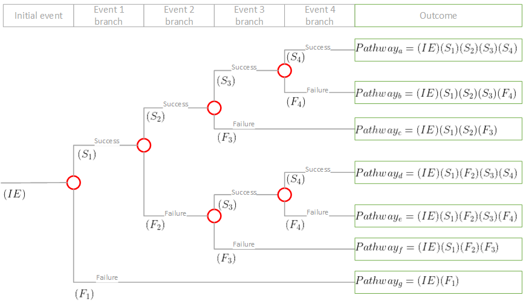

_draft_

# Event Tree Analysis (ETA)

## Example(s)

## Introduction 
Event tree analysis (ETA) is a forward (bottom-up), logical modeling technique for both success and failure that explores responses through a single initiating event and lays a path for assessing probabilities of the outcomes and overall system analysis.[[1]](#references) This inductive analysis technique is used to analyze the effects of functioning or failed systems given that an event has occurred. [[2]](#references) \
This technique explores system responses to an initiating _challenge_ and enables assessment ofthe probability of an unfavorable or favorable outcome. The system challenge may be a failure or fault, an undesirable event, or a normal system operating command.[[1]](#references)
The ETA method can be used in conjuction with the FTA (_Fault Tree Analysis_) method, where FTA focuses on preventing multiple causes to the main undesired event, whereas ETA focuses on mitigating multiple consequences from the main undesired event. This conjuction of these techniques is sometimes called a _'Bow-tie'_ technique.

## History
The concept of what eventually came to be named _Event Tree_ was conceived by the UKAEA (United Kingdom Atomic Energy Agency) in 1968, as risk assesment tool to optimize the design of a 500MW Steam-Generating Heavy Water Reactor. Use of ETA resulted into a manageable form. [[1]](#references) 

The term "Event Tree" was first introduced during the WASH-1400 nuclear power plant safety study circa 1974.

## Variations
Specific variations or successions of main hazard analysis method.

## Application
Popular safety study fields wherein ETA is used:
* Nuclear power plants
* Spacecrafts
* Chemical plants
* Dams and levees [5](https://youtu.be/hhnPJxXFnXk?t=1800)

## Method steps
The following steps are necessary to successfully employ the Event Tree Analysis.

1. Define the system: Define what needs to be involved or where to draw the boundaries.

2. Identify the accident scenarios: Perform a system assessment to find hazards or accident scenarios within the system design.

3. Identify the initiating events: Use a hazard analysis to define initiating events.

4. Identify intermediate events: Identify countermeasures associated with the specific scenario.

5. Build the event tree diagram

6. Obtain event failure probabilities: If the failure probability can not be obtained use fault tree analysis to calculate it.

7. Identify the outcome risk: Calculate the overall probability of the event paths and determine the risk.

8. Evaluate the outcome risk: Evaluate the risk of each path and determine its acceptability.

9. Recommend corrective action: If the outcome risk of a path is not acceptable develop design changes that change the risk.

10. Document the ETA: Document the entire process on the event tree diagrams and update for new information as needed.

* Theoretical example
* Example of historical factual application

## Best practices/ things to avoid
Before constructing an event tree, here are some basics and rules to ensure a qualitative and robust event tree: [[5]](#references)
* All probabilities must be greater than or equal to zero and less than or equal to one \
  $`0 \leq P(x) \leq 1`$
* Sum of probabilities corresponding to a horizontal chance node column must be equal to one 
* Probabilities for each branch must be conditional on all preceding branches (all prior pathway events)

Additionally, these rules of thumb are to be considered:

* Each branch represents an event 
* An event sequence must be logical, but not necessarily chronological
* Branches must be [mutually exclusive](#used-terminology) and collectively exhaustive](#used-terminology)

1. 

## Pros and cons
Following are advantages and disadvantages of utilizing ETA.

### Advantages: 
* Enables the assessment of multiple, co-existing faults and failures[[1]](#references)
* Functions simultaneously in cases of failure and success[[1]](#references)
* No need to anticipate end events[[1]](#references)
* Areas of single point failure, system vulnerability, and low payoff countermeasures may be identified and assessed to deploy resources properly[[1]](#references)
* Paths in a system that lead to a failure can be identified and traced to display ineffective countermeasures.[1]
* Work can be computerized[[3]](#references)
* Can be performed on various levels of details[[3]](#references)
* Visual cause and effect relationship[[3]](#references)
* Relatively easy to learn and execute[[3]](#references)
* Models complex systems into an understandable manner[[3]](#references)
* Follows fault paths across system boundaries[[3]](#references)
* Combines hardware, software, environment, and human interaction[[3]](#references)
* Permits probability assessment[[3]](#references)
* Commercial software is available[[3]](#references)

### Disadvantages: 
* Addresses only one initiating event at a time.[[1]](#references)
* The initiating challenge must be identified by the analyst[[1]](#references)
* Pathways must be identified by the analyst[[1]](#references)
* Level of loss for each pathway may not be distinguishable without further analysis[[1]](#references)
* Success or failure probabilities are difficult to find.[[1]](#references)
* Can overlook subtle system differences[[3]](#references)
* Partial successes/failures are not distinguishable[[3]](#references)
* Requires an analyst with practical training and experience[[3]](#references)

## Additions/ Notes

Following are 10 tips for Event Tree Analysis[[4]](#references):

1. List the barriers which are designed to protect against the initiating event of concern in the same order as the one in which they would be called upon to act as an incident progressed, e.g. fire alarm before sprinkler system. This is because their order of occurrence may affect the outcome (in this case, whether building occupants would have a chance to leave the building before being sprayed with water).

2. Every time you introduce an extra barrier within your event tree analysis you potentially at least double the size of your tree with up to 2n possible outcomes if there are n barriers and two branches for each. Therefore, if possible, define the scope of your analysis such that you consider no more than 6-8 barriers, particularly if you will not be using software for your analysis!

3. Within an Event Tree, when listing the barriers, phrase all of the questions in terms of the ability of those barriers to act effectively, e.g. “Is the fire alarm activated?”, and then draw the tree such that the branch indicating a positive response is always upwards. This will ensure that the preferred scenarios tend to be clustered together towards the top of the Outcomes column while the least desirable scenarios are grouped near the bottom of the column.

4. Remember that barriers can include administrative and personnel activities (e.g. human actions) as well as engineered safety systems (e.g. alarms, interlocks, automatic valves). It may also be necessary to consider physical phenomena such as the presence of ignition sources or weather conditions where these may affect the outcome.

5. Although most branch points have two outcomes (depending on whether or not the barrier operates successfully or not), it is perfectly acceptable to have only one outcome (where operation or otherwise has no impact on a particular branch of the event tree). Similarly, there may be cases where it is appropriate to consider more than two outcomes, for example where the outcome depends on the number of components which operate correctly on demand at that stage in the sequence of events.

6. The relative probabilities of the different outcomes are dependent on the number of barriers that need to fail for each outcome to occur – as a first approximation, the more barriers that need to fail for an outcome to occur, the lower the probability of the outcome.

7. The initiating event can be assigned a frequency (i.e. with units 1/time), or probability (dimensionless quantities with values in the range 0-1). However, the values assigned to the branch splits should always be probabilities.

8. Don’t forget that the probabilities associated with any branch point should always add up to 1 – this is because the branches emanating from any branch point should represent all possible outcomes.

9. Event trees use conditional probabilities, i.e. the probability of success or failure at each barrier is conditional on the success or failure at each barrier that preceded it. Therefore, for example, it may be appropriate to assign a higher value to the probability of a bund alarm not working if the high level alarm in the associated tank (which is the same design and which is maintained by the same maintenance crew) has already failed. Common cause failures can therefore be represented very effectively within an event tree.

10. When quantifying an event tree, a useful check is to sum the frequencies of all of the different outcomes. This sum should equal the frequency of the initiating event since the event tree should have identified all the possible outcomes resulting from the occurrence of that initiating event.

## Used terminology
Glossary containing as many relevant and specific terms

| Term | Definition |
| - | - |
| Accident event | First significant deviation from a normal situation that may lead to unwanted consequences. |
| Barrier | - |
| Branch | Represents an event, which may be system response, human action/ intervention, emergency response or a continuously operating/ standby sytems. |
| Branch probability | Probability of the event (branch) conditioned on occurence of those events that precede it (to the left) in the tree. |
| Chance node | Branching point at which a new (random) variable is introduced in the tree. |
| Collectively exhaustive | Of a set of probabilistic events, the total sum of the probabilities must equal 1; unknowns are not permitted. |
| End node | Nodes that is found at the end of a event tree, at the right most side. |
| HAZOP | **Haz**ard and **Op**erability, a hazard analysis method utilized mainly for indentifying possible hazards in a process. |
| Mutually exclusive | In ETA, a requisite that 2 or more events cannot happen at the same time probabilistically; the have no or negligible overlap. |
| Pathway | Vertical line that traverses (chance) nodes until the end node, from left to right. Each pathway must be unique. |
| Pipe | Vertical line that seperates the conditional event(s) from (a) probabilistic variable(s). |
| - | - |

## See also
* WASH-1400 [NUREG-75/014](https://www.nrc.gov/docs/ML0706/ML070610293.pdf) Reactor Safety Study, United States Nuclear Regulatory Commission, October 1975

## References
1. Clemens, P.L.; Rodney J. Simmons (March 1998). "System Safety and Risk Management". NIOSH Instructional Module, A Guide for Engineering Educators. Cincinnati,OH: National Institute for Occupational Safety and Health: IX-3–IX-7.
2. Wang, John et al. (2000). [What Every Engineer Should Know About Risk Engineering and Management, p. 69.](https://books.google.com/books?id=x4Ft7H_2Ik0C&pg=PA69), p. 69, at [Google Books](https://en.wikipedia.org/wiki/Google_Books)
3. Ericson, Clifton A. (2005). [Hazard Analysis Techniques for System Safety](https://onlinelibrary.wiley.com/doi/book/10.1002/0471739421). John Wiley & Sons, Inc.
4. Egerton, Amanda (March 7th, 2016) [10 Tips for Event Tree Analysis](https://egertonconsulting.com/10-tips-for-event-tree-analysis)
5. USACE Risk Management Center[channel](https://www.youtube.com/@usaceriskmanagementcenter). [DLS-105 Module 1: Basics of Probability Theory and Event Tree Analysis](https://youtu.be/hhnPJxXFnXk)
