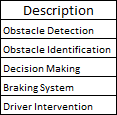
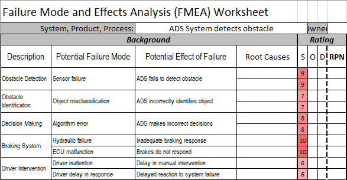
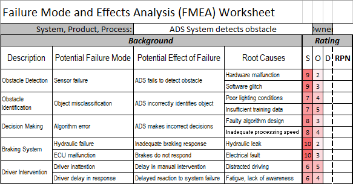

# Failure Mode and Effect Analysis (FMEA)

## Introduction 
[[Failure Mode and Effects Analysis (FMEA) - asq.org](https://asq.org/quality-resources/fmea)] \
Failure Mode and Effect Analysis (FMEA) is a hazard analysis technique, used for identifying all possible failures in a manufacturing/ assembly process, product or service. Best implemented early in the design phase, the goal of FMEA if to eliminate or mitigate failures. Through the FMEA process, failures are identified and numerically prioritized starting from the least desired outcome.

## History
_First inception and cause of hazard analysis method. (Year, person/ group, (geographic) location)_ \
Procedures for FMEA were first described November 9th 1949 by the U.S. Department of Defense (MIL-P-1629) [x] as FMECA (Failure Mode, Effects and Criticality Analysis). Primarily utilized in the military industry, it was later adopted by the space industry (NASA). In the 1970 in was introduced to the automotive industry (Ford).

## Underlying systems
Possible underlying system or system predecessor of current hazard analysis.

## Application
Used for: (List)\
Most use cases in current day. Type(s) of application domains.

## Variations
_Specific variations or successions of main hazard analysis method._ \
* FMECA (*Failure Modes, effects and criticality analysis*)
  Similar to the FMEA process, this variant encorporates Criticality as an additional parameter. A Critical characteristic associated with a failure mode is a measurements or indicators that reflect safety or compliance with government regulations and need special controls. Critical characteristics have a high severity rating because of this. Note: FMECA is sometimes used interchangably with FMEA. \
* DFMEA (Design FMEA)
* PFMEA (Process FMEA) (https://safetyculture.com/topics/fmea/)
* AFMEA (Advanced FMEA)

## Method steps
_Specific steps, formulas, symbols and/or terminology_ \

### 1. Define scope
What is the goal of the process? Is it in the realm of concept design, system or service? Is there a desired level of detail and what are the boundaries? The result should be clear.

### 2. Assemble interdisciplinary team
A team of experts specializing in fields pertaining to the project should be assembled. 

### 3. Identify scope functions
Utilizing flowcharts, attempt to encompass the purpose and desired expectation of the system, design, process or service. Use it with a verb followed by a noun. Where necessary, break the scope down into smaller parts, and identify the function of those parts. 

### 4. Define Failure Modes
For all identified functions, identify every way that function might fail. Failure modes can generally fill in 1 of 3 categories:
1. Loss of function: The item, functional block or subsystem is no longer operating and the function previously performed by it is gone.
2. Erroneous function: The item or functional block is operating within design thresholds and parameters, but not in the desired way.
3. Incorrect function: The item or functional block is operating outside design thresholds and parameters.

### 5. Determine failure severity
For each identified failure, determine the the severity. Signified as "S", severity denoted the degree of negative impact of a potential failure. Noted as "S" on the FMEA sheet, severity is usually noted on a 1-10 scale, in which 10 can be likened to catastrophe and 1 to insignificant.

### 6. Determine potential root causes
For each identified failure, identify all possible root causes. Utilize expertise and cause analysis tools to encompass as many causes possible, and add them to the FMEA sheet.

### 7. Determine occurence rating
For each identified failure, estimate the probability of the failure actually occurring. Occurence is noted on a 1-10 scale, in which 10 can be likened to inevitability and 1 to (extreme) unlikeliness.

### 8. Determine process controls
For each identified failure, put measures in place that prevent or maximally mitigate a failure from reaching a potential customer or the rest of the system. 

### 9. Determine detection rating
For each failure, determine the rate a process control can detect a failure, before the rest of the system or outside world (customer) are affected. Noted as "D" on hte FMEA worksheet, detection is usually between a 1-10 scale, in which 10 can be likened to a problem being certainly undetectable (or no process control present) and 1 is a certainty of detecting a problem.

### 10. Calculate the Risk Priority Number (RPN)
Multiply the S(everity), O(ccurence) and D(etection) ratings into a Risk Priority Number. This number is the potential failure score for the corresponding failure, and can be used to prioritize relevance.

### 11. Implement changes
Assign actions that lower the RPN, by focusing on mitigating the underlying Severity, Occurence and Detention rating. These actions should be assigned to an expert with a corresponding completion date.

### 12. Measure effectiveness and evaluate
Measure the effectiveness of the assigned actions and log their progress.

## Example(s)
Now we will go through the [steps](#method-steps) in wherein the filling in of an FMEA worksheet takes place. These steps will start from #3 through #11. The worksheet layout used will be the same as the FMEA worksheet image displayed above.

The example scenario will be in the context of and _ADS (Automated Driving System)_ detecting an object while on the road. 

| Step | Description | Visualization |
| - | - | - |
| 1-2 | Define scope  Assemble Interdisciplinary team Identify scope functions | Due to these steps already being defined, these steps will be skipped for the purposes of this example case. |
| 3 | Identify scope functions: In the scenario of an ADS detecting an obstacle, what are the main functions or (sub)systems that are involved in that scenario? For this excercise, these will be: Obstacle Detection  Obstacle Identification  Decision Making  Braking System  Driver Intervention. |  |
| 4 | Define failure modes: Find the maximum amount of ways each of the above (sub)systems may fail, following by what would be the consequence of that failure.  |  |
| 5 | Determine failure severity |  | 
| 6 | Determine potential root causes |  |
| 7 | Determine occurence rating |  |
| 8 | Determine process controls | - |
| 9 | Determine detection rating | - |
| 10 | Calculate Risk Priority Number | - |
| 11 | Implement changes | - |

## Pros and cons
List of advantages and disadvantages

_Disadvantages_ \
* Possibly labor intensive: FMEA can become time-consuming and laborious when in the case of complex systems with numerous components and potential failure modes
* Subjectivity: Assignment of Severity, Occurence and Detection can be subjective, making it harder to find concensus (similar RPN scores) between (many) analysts, which may lead to inconsistent results
* FMEA focuses more on individual single-point failures, and is not equipped for subsystem-interactive failures
* FMEA does not formally encapsulate time-based effects of system components, potentially missing failure modes that are time-dependent

_Advantages_\
* One of the most widely used and available hazard analysis methods
* Detailed focus on overview and analysis of individual components and subsystems
* (Advanced) probabilistic techniques not required for implementation
* Encourages a proactive approach to identify and mitigate potential failure modes before they occur, enhancing reliability and safety

## Additions/ Notes
[FMEA Example Worksheet](example_files/fmea_testsheet_95.xls)

## Used terminology
Glossary containing as many relevant and specific terms 

| Term | Definition |
| - | - |
| Action Priority (AP) | A new gradient from the AIAG/ VDA handbook[2], replacing the classical FMEA RPN and risk matrix. The AP aims to encompass additional improvement measures. |
| Criticality | - |
| Detection | Signified as "D", detection denotes the degree a process controls can detect either the failure mode or its cause before the client is affected. Usually noted on a 1-10 scale, in which 10 can be likened to a problem being certainly undetectable (or no process control present) and 1 is a certainty of detecting a problem. |
| End Effect | Consequence a failure mode has upon operation, function or status at the highest indenture level |
| Failure | Any error, defects or abnormalities that negatively impact system functionality, especially affecting the customer. |
| Failure Effect | The immediate consequence of a failure during operation.  |
| Indenture levels | Levels which indentify or describe (relative) complexity of a function or assembly. |
| Local Effect | The consequence a failure mode has on the current specific operation, function or status under analysis. |
| Next higher level effect | Consequence a failure mode has on operation, function or status at the next higher indenture level above the currently analyzed item. |
| Occurrence | Signified as "O", occurrence denotes a (probabilistic) chance of a failure occurring. Usually noted on a 1-10 scale, in which 10 can be likened to inevitability and 1 to (extreme) unlikeliness. |
| Process Control | Preventative or mitigating procedures, mechanisms or tests that attempt to prevent or curtail a failure before the client is affected. |
| Risk Priority Number (RPN) | A multiplication of $`S \times O \times D`$, the total score helps prioritize failures by overall criticality. |
| Severity | Signified as "S", severity denoted the degree of negative impact of a potential failure. Usually noted on a 1-10 scale, in which 10 can be likened to catastrophe and 1 to insignificant. |
| Single Point of Failure (SPOF) Single Failure Points (SFP) | Part of a system that, if it fails, will stop the whole system form working |

## See also
A more extensive history and standards regarding FMEA can be found at [FMEA history](https://www.superengineer.net/blog/fmea-history) \
### FMEA Standards
* MIL-STR 1629  - “Procedures for performing a failure mode and effect analysis” (FMECA) _(Discontinued 1998)_
* MIL-HDBK-338B
* IEC 60812  - [“Procedures for failure mode and effect analysis (FMEA)”](https://webstore.iec.ch/publication/26359) _(2018-18-10)_
* BS 5760-5  - [“Guide to failure modes, effects and criticality analysis (FMEA and
FMECA)”](https://knowledge.bsigroup.com/products/reliability-of-systems-equipment-and-components-guide-to-failure-modes-effects-and-criticality-analysis-fmea-and-fmeca?version=standard) _(Withdrawn June 6th 2006)_
* SAE ARP 5580 - [“Recommended failure modes and effects analysis (FMEA) practices for non-automobile applications”](https://www.sae.org/standards/content/arp5580/) _(Reaffirmed 2020-08-07)_
* SAE J1739  - [“Potential Failure Mode and effects Analysis in Design (Design FMEA) and Potential Failure Mode and effects Analysis in Manufacturing and Assembly Processes (Process FMEA) and effects Analysis for Machinery (Machinery FMEA)”](https://www.sae.org/standards/content/j1739_202101/) _(Revised 2021-01-13)_
* SEMATECH (1992) - [“Failure Modes and effects Analysis (FMEA): A Guide for Continuous Improvement for the Semiconductor Equipment Industry”](https://www.yumpu.com/en/document/view/3574368/failure-mode-and-effects-analysis-fmea-a-guide-for-sematech)
* FMEAAV-1 - _IAG& VDA FMEA Handbook_ [2] _(Automotive) (August 2022)_

## References
[1] [What is FMEA? Failure Mode & Effects Analysis | ASQ](https://asq.org/quality-resources/fmea) \
[2] [IAG& VDA FMEA Handbook](https://www.aiag.org/quality/automotive-core-tools/fmea) _(Automotive) (August 2022)_

