# Fault Tree Analysis (FTA)

## Introduction 

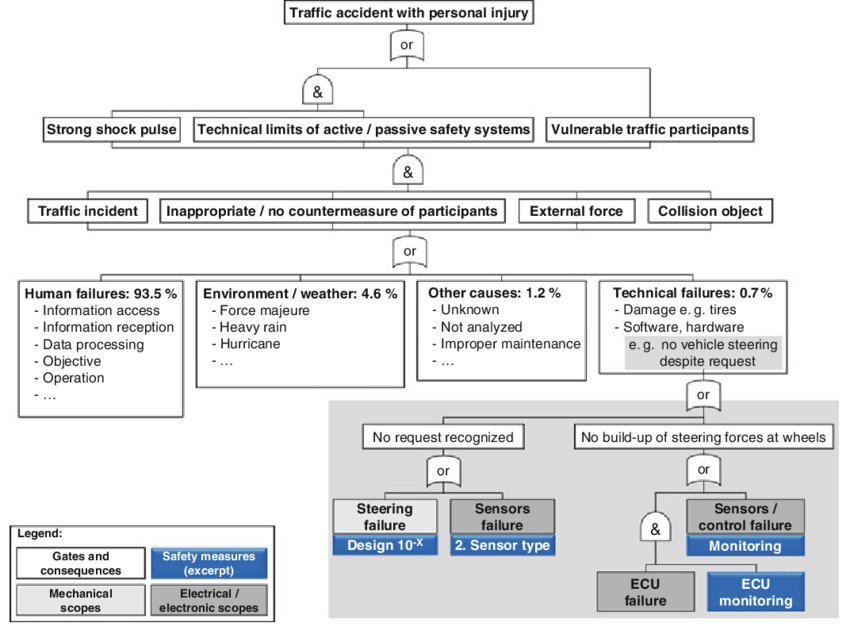 

Fault Tree Analysis (FTA) is a deductive top-down failure analysis tool. Starting at the root cause of a potential failure, a breakdown of composite parts is established to identify, analyze and mitigate undesired state of a system. This is usually done visually resembling a flowchart diagram, with downwardly cascading branches with corresponding probabilities and Boolean logical gateways into what is called a _fault tree_. Analysis of the fault tree can be used for:

* Providing clarity and logical foundation directly starting from a failure or otherwise underised state.
* Diagnosing and mitigating the caus(es) of a top event.
* A tool to assist in the design of a system, name to hope create (output/ lower level) requirement.
* Optimize and minimize resources.
* Substantiate compliance with system safety/ reliability requirements.

Image from Development and Approval of Automated Vehicles: Considerations of Technical, Legal, and Economic Risks, [1], CC4.0 

## History
Fault tree Analysis was originally developed in 1962 Bell laboratories by H. Watson and A Mears, to evaluate the _Minuteman I Intercontinental Ballistic Missile_ for the U.S. Air Force.[[2]](#references) Since then, fault trees have gained in popularity as a failure analysis tool.

## Underlying systems
FTA is based on Reliability theory, Boolean algebra and probability theory. A very simple set of rules and symbols provides the mechanism for analyzing very complex systems, and complex relationships between hardware, software and humans. [[2]](#references)

## Variations
There are several variations of the FTA method. Though not exhaustive, the following list contains 10 FTA variations of note.

1. **Dynamic Fault Tree Analysis (DFTA)**: \
   DFTA incorporates time-dependent behavior and system dynamics into traditional FTA. It is particularly useful for systems where component failures and repairs occur over time.
2. **Probabilistic Fault Tree Analysis (PFTA)**: \
   PFTA quantifies the likelihood of the top event by assigning probabilities to the basic events. This approach uses probability theory and statistical methods to calculate the overall system failure probability.
3. **Common Cause Failure Analysis (CCFA)**: \
   CCFA is an extension of FTA that focuses on common cause failures (CCFs) where multiple failures result from a single root cause. It is used to identify and analyze dependencies between events that can lead to simultaneous failures.
4. **Bayesian Fault Tree Analysis (BFTA)**: \
   BFTA integrates Bayesian networks with FTA to handle uncertainties and update failure probabilities as new information becomes available. This method is particularly useful for complex systems with limited failure data.
5. **Markov Fault Tree Analysis (MFTA)**: \
   MFTA combines Markov chains with FTA to model state transitions and time-dependent behaviors in the system. It is useful for systems with multiple states and transitions over time.
6. **Dynamic Reliability Block Diagram (DRBD)**: \
   DRBD combines the concepts of reliability block diagrams (RBD) with dynamic behaviors to model complex systems. It is similar to DFTA but uses a block diagram representation instead of a fault tree.
7. **Software Fault Tree Analysis (SFTA)**: \
   SFTA is tailored for software systems and focuses on identifying potential software faults and their impacts on the overall system. It considers software-specific issues such as bugs, code errors, and logic flaws.
8. **Integrated FTA (IFTA)**: \
   IFTA integrates FTA with other analysis techniques such as Failure Modes and Effects Analysis (FMEA) or Event Tree Analysis (ETA) to provide a comprehensive assessment of system reliability and safety.
9. **Hierarchical Fault Tree Analysis (HFTA)**: \
   HFTA organizes fault trees into hierarchical levels, allowing for a more structured and scalable analysis of complex systems. It breaks down the system into manageable sub-systems and analyzes each level separately.
10. **Petri Net Fault Tree Analysis (PNFTA)**: \
    PNFTA uses Petri nets to represent fault trees, enabling the modeling of concurrent and asynchronous events. It is useful for analyzing systems with parallel processes and interactions.

## Applications
Fault Tree Analysis is a tried-and-true analysis method utilizied in many industries. A few these include (including a few use cases):

* Aerospace/ aviation (such as analyzing potential failure modes entailing engine failure or loss of control)
* Nuclear energy (such as evaluating scenarios that could lead to reactor core damage or radioactive release)
* Automotive (such as analysis potential causes of brake failure or unintended acceleration)
* Chemical and Process industries (such as identifying potential causes of chemical releases or explosions)
* Defense and Military (such as evaluating causes of missile guidance system failures or communication breakdowns)
* Software and IT systems (such as identifying possible causes of software bugs or cyber-security breaches.)

## Method steps
Following are steps necessary to apply the FTA method.

### 1. Define hazard
Start by clearly and concisely describing the hazard (top event). As this will be the basis for following steps, a specific and measurable definition is recommended. Clarifying factors for top event precision may include: [[4]](#references)
* How much?
* How long (duration)?
* What is the safety impact?
* What is the environmental impact?
* What is the regulatory impact?

### 2. System analysis and contributing events identification
Identify factors and events that might contribute to the most undesired (top level) event. These factors should fall into 2 categories: [basic events](#used-terminology) and [intermediate events](#used-terminology). \
* Create or utilize the following resources: [[4]](#references)
	* List of components (Bill of Materials)
	* Boundary Diagram
	* Schematic
	* Code requirements
	* Engineering Noises and Environments
	* Existing examples or templates of similar products or failures

* Identify potential causes:
	* Include experts on the subject (such as system design engineers or reliability engineers) 
	* consult similar product or failure history and/ or external (historical) records

* Estimate probability of causes at the basic-event level

### 3. Construct the fault Tree
Construct a visual fault tree diagram using standard [gate symbols and event symbols](#symbols). The _top event_ should at the top, and any relations to that cause below it in a hierarchical fashion. Following this, basic events must end up at the bottom. \
The middle portion of the tree which entails intermediate events require more attention. In pathing the tree, [logic gates](#event-symbols) should be utilized.

For clarity, color codes can be used for basic events to prioritize critical paths. These can range from green (acceptable risk) to yellow/orange (moderate/ high risk) to red (critical risk). \

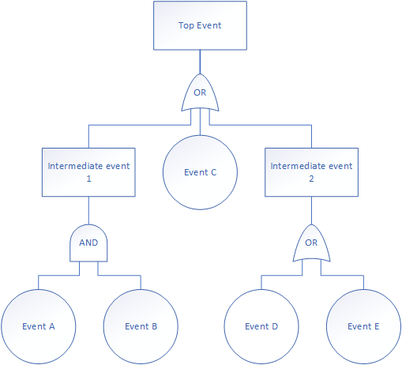 \
 
### 4. Gather failure data
In order to assess risks of (basic) events occuring, resources should be allocated accruing failure data. This failure data is expressed as _failure data_ or _failure rates_, depending upon the type of analysis. \
Sources for these failure data may include:
* Historical records
* Manual of similar product(s) or subcomponents
* Industry databases
* Expert opinions

### 5. Perform the analysis
Calulate/ estimate the risk of each event by the acquired failure data to lay bare the critical chain to the top event ([cut sets](#used-terminology)). 

These calculations are associated with _statistical probabilities_ or _Poisson-Exponentially distributed constant rates_. For example, for a given component with constant _failure rate_ $\lambda$ and exposure time $t$, there is: \
$`P=1-e^{-λt}`$ \
where: \
$`P\approx \lambda t`$ if $`\lambda t<0.001`$ 

When encountering logic gates in a cut set, care must be taken to maintain the corresponding input event integrity. Global rules for for conservation of inputs at logic gates are:

| Symbol | Name | Formula |
| :---: | :---: | - |
| 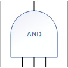 | `AND` | P (A and B) = P (A ∩ B) = P(A) P(B) |
| 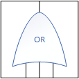 | `OR` | P (A or B) = P (A ∪ B) = P(A) + P(B) - P (A ∩ B) |
| 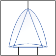 | `XOR` | P (A xor B) = P(A) + P(B) - 2P (A ∩ B) |

Output of an `AND` as a combination of input events $`1`$ and $`2`$ where $`Q=1-e^{-λt}`$ if $`\lambda t<0.001`$: \
Failure frequency=$`\lambda_1 Q_2 + \lambda_2 Q_1`$ \
Failure frequency=$`\lambda_1 \lambda_2 t_2 + \lambda_2 \lambda_1 t_1`$ if $`\lambda_2 \lambda_1 t_1 < 0.001`$ and $`\lambda_2 t_2 < 0.001`$ 

Cut sets wirth risk greater than the system can tolerate are selected for mitigation. Actions are required for _Critical_ (red) and _High Risk_ (orange). 

List of cut sets can be used for identifying duplicated events and branches, often referred to as _MOB's_ (multiple occurring branches) and _MOE's_ (multiple occurring events). 

### 6. Risk mitigation
Depending on the system being analyzed, Risk Mitigation can take many forms. One popular method is the use of a _criticality method_, which use a broad selection of indicators to describe various factors including geological, technological, geopolitical, social, and environmental factors. 

Other techniques require a level of mitigation calculated to _Defects per Million Opportunities_ (_DPMO_). DPMO is defined as: \
$`DPMO=\frac{1.000.000 \quad \times \quad number \quad \quad of \quad defects}{number \quad of \quad units \quad \times \quad number \quad of \quad Defects \quad opportunities \quad per \quad unit}`$ 

When unacceptable risks have been found, multiple mitigation strategies are available. Some examples:
* Design change
* Replacement of (Base-event) component with another component with higher reliability
* Physical redundancy of (Base-event) component
* Software redundancy
* Warning system
* Quality Control

## Things to avoid
While going through the steps of utilizing a FTA cycle, there are some elements best to avoid in order to reach success. Following are some matters best to be avoided: 
* Relying on incomplete, outdated or inaccurate data.
* Performing the analysis without consulting with experts of the relevant field
* Too broad categorizations; events not sufficiently broken down
* Using non-standard symbols and conventions
* Overlooking cases where a single cause leads to multiple failures (_CCFs, Common Cause Failure_)

## Pros and cons
### Advantages of FTA
* Very good at showing how resistant a system is to single or multiple initiating faults

### Limitations to FTA
* The accuracy and effectiveness of FTA in analyzing relevant causes of failure is heavily reliant on the expertise of the analysts [[3]](#references)
* Large and complex systems require large and complex fault trees, which makes analysis time-consuming and challenging [[3]](#references)
* One single top event can be examined at a time [[3]](#references)
* Data regarding failure and quality determines precision of calculated probabilities in a fault tree [[3]](#references)
* Not good at finding all possible initiating faults

## Used terminology
Glossary containing as many relevant and specific terms
| Term | Definition |
| - | - |
| Basic event | Events that cannot be broken down further into more fundamental composite parts, the lowest level in a fault tree. | 
| Cut set | Combination of basic event(s) causing the top event. |
| Input event | Event that is sent from a basic event or intermediate even into a (logic) gate. |
| [Intermediate event](event-symbols) | Event between the top event and lower level (basic) event. Therefore, an intermediate event always causes 1 or more event(s) and itself is cause by preceding event. |
| Logic gate | A conjunction between events that output probabilities related to the set operations of Boolean logic. |
| Minimal Cut Sets (MCS) | In a cut set, if no event can be removed without failing to cause the top event. |
| MOB | Multiple occurring branches |
| MOE | Multiple occurring events |

## Symbols

### Event Symbols
Event symbols
| Symbol | Term | Meaning |
| :---: | - | - |
| 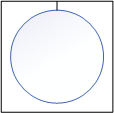 | Basic Event (BE) | Lowest-level random event that cannot be broken down further with sufficient data available. | 
| 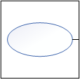 | Conditioning Event | Specific condition or restriction associated with another logic gate. |
|  | Top Event (TE) | The main undesired outcome or state of system. |
|  | Intermediate event | Event between the top event and lower level (basic) event. Therefore, an intermediate event always causes 1 or more event(s) and itself is cause by preceding event. |
|  | External (House) event | Event of which its occurence is expected. Generally has a fixed probability of 0 or 1. |
|  | Un(der)developed event | Event about which there is insufficient information available, or is inconsequential. |

Logic gates and advanced symbols
| Symbol \ Logic Gate | - | Meaning | Symbol \ Advanced | - | Meaning |
| :---: | - | - | :---: | - | - |
|  | `AND` gate | Output event occurs only when *all* input events occur. | 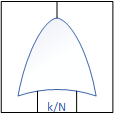 | k/N gate | Output event occurs a certain amount `k` of total input events `N` occur. |
|  | `OR` gate | Output event occurs when *any* of the input events occur. | 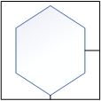 | Inhibit gate | Output event occurs when input event occurs, and corresponding condition is satisfied. |
|  | Exclusive `OR` gate (`XOR`) | Output event occurs only if *either input* events occurs (never both or none). | 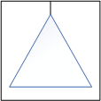 | Transfer In | The tree is developed urther at another point within the tree. |
| 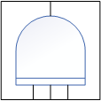 | Priority `AND` gate | Output event occurs when *all* input events occur, in a *specific sequence*. | 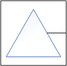 | Transfer Out | This portion of the tree is attached to another location within the same tree. |

## See also
### FTA Standards
* [NEN-EN-IEC 61025:2007](https://www.nen.nl/nen-en-iec-61025-2007-en-fr-116774) _(Published April 1st, 2007)_
* [ISO/IEC 31010:2019](https://www.iso.org/standard/72140.html) _(Published June 2019)_

## References
[1] Winkle, Thomas. 2016. Technische Universität München. ["Development and Approval of Automated Vehicles: Considerations of Technical, Legal, and Economic Risks"](https://www.researchgate.net/publication/303480787_Development_and_Approval_of_Automated_Vehicles_Considerations_of_Technical_Legal_and_Economic_Risks), Autonomous Driving (pp.589-618) \
[2] [Fault Tree Analysis – A History](https://web.archive.org/web/20110723124816/http://www.fault-tree.net/papers/ericson-fta-history.pdf) \
[3] [What is fault tree analysis (FTA)?](https://www.ibm.com/topics/fault-tree-analysis) \
[4] [FTA | Fault Tree Analysis](https://quality-one.com/fta/) \

----- \
[5] [What is a "cutset"](https://www.wilderisk.co.uk/about/blog/cutset-in-fault-tree-analysis/) \

