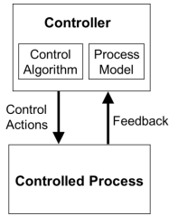
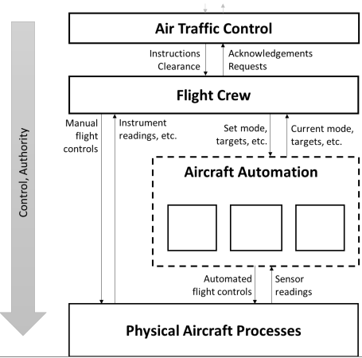
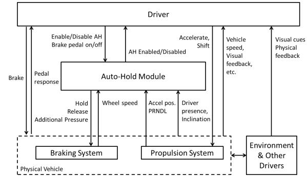
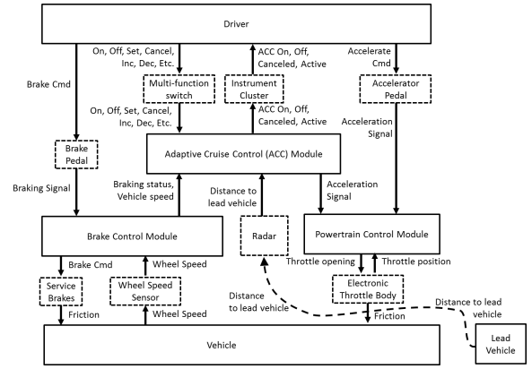
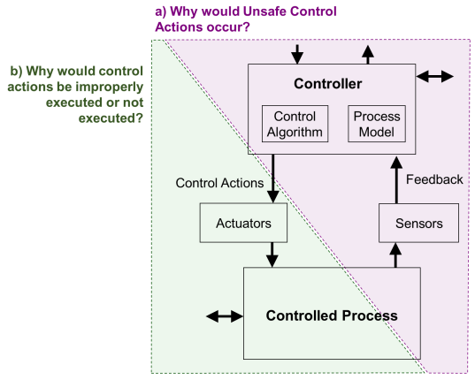
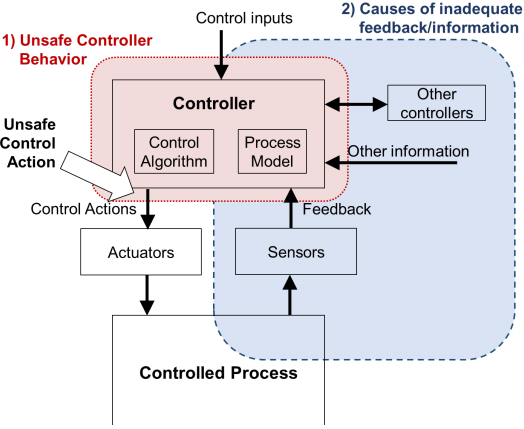
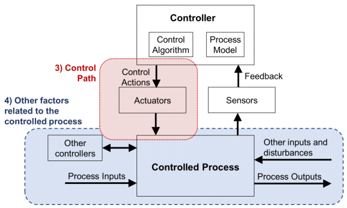
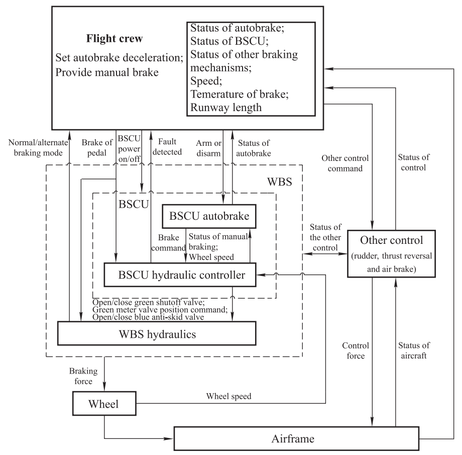

# System-Theoretic Process Analysis

## Introduction 
System-Theoretic Process Analysis (STPA) is fairly recent top-down hazard analysis technique. This technique is generally used in larger, complex systems. What differentiates the STPA method from other traditional hazard analysis techniques is the emphasis on (abstract) intended functionality of subsystems from the top down, rather than a regression into the smallest subsystems or components of a system. Another differentiating approach of STPA is the conclusion that unsafe interactions between system components could occur, when none of those individual system components may have failed.

## History
STPA is a analysis technique developed by [Nancy Leveson](http://sunnyday.mit.edu/bio-serious.html) and [John P. Thomas](http://web.mit.edu/jthomas4/www/index.htm). It is founded upon _System-Theoretic Accident Model and Process_ (STAMP), which is in turn based on Systems Theory.

## Underlying systems
Underpinning STPA are other theoretical frameworks, which are described below.

### STAMP - System-Theoretic Accident and Processes
STAMP is an accident causality model based on Systems Theory. It expands beyond the traditional model of causality to include more complex processes and unsafe interaction among system components. STAMP focuses on understanding and managing the control structures and safety constraints necessary to prevent accidents in complex systems.

### Systems Theory 
Systems Theory is an interdisciplinary framework that studies the complex interactions and behaviors of systems as wholes rather than just the sum of their parts. It emphasizes the importance of relationships, feedback loops, and the dynamic behavior of systems over time. Systems Theory is applied to a wide range of fields, including biology, engineering, and social sciences, to understand how components of a system interact to produce emergent properties and behaviors that cannot be understood by examining the components in isolation.

## Variations
**CAST** - Causal Analysis based on Sytems Theory (CAST) is a retroactive analysis method that examines an accident/incident that has occurred and 
identifies the causal factors that were involved. It is another analysis method based on STAMP. [p12-13] 

## Application
Fields in which the STPA is applied:
* Aerospace (Such as NASA and in aviation)
* Automotive (In the context of _Autonomous Driving Systems_ (ADS) and _Advanced Driver-Assistence Systems_ (ADAS)
* Healthcare [[2]](#references)
* Nuclear Energy [[3]](#references)
* Railroading [[4]](#references)
* Military Defense [[5]](#references)
* Chemical and Process Industries 

## Method steps
The STPA method steps are defined in 4 parts, described below.

### 1. Scope
The first step defines the purpose of the analysis. What is the system boundary that is being described that seperates all relevant subsystems (the _system_) from the outside/ negligible parts (the _environment_)? This part consists of four steps:
1. Identify [losses](#used-terminology)
   * Encapsulation of relevant stakeholders, and their stake in the system
   * What type of losses? (human life, reputation, privacy, security, etc)
   * Translate each relevant goal or value into a list of losses: `L-<number>: Loss (of) <critical objective>` \
     Such as: `L-1: Loss of life or injury to people`
   
   Some tips to prevent common mistaks when identifying losses:
   1. Losses can include any loss that is unacceptable to any stakeholder
   2. Losses should not reference individual components or specific causes like “human error” and “brake failure”
   3. Losses may involve aspects of the environment that are not directly controlled by the system designer
   4. Document any special considerations or assumptions made, such as losses that are explicitly excluded
2. Identify [system-level hazards](#used-terminology):

   Once the system and system boundary is identified, the next step is to define the system-level hazards by identifying system states or conditions that will lead to a loss in worst-case environmental conditions. 
   * Translate each system-level hazard into a list using the follosing general notation: `<Hazard specification> = <System> & <Unsafe Condition> & <Link to Losses>`
     Such as: `H-1 = Aircraft violate minimum separation standards in flight [L-1, L-2, L-4, L-5]`
	 
    In general, a hazard can lead to one or more losses and each hazard should be traced to the resulting losses. This traceability is typically documented in brackets after the hazard description. The example above shows the traceability to the loss(es) previously constructed.
	
    There are three basic criteria for defining system-level hazards:
    1. Hazards are _system_ states or conditions (not component-level causes or environmental states)
    2. Hazards _will_ lead to a loss in some worst-case environment
    3. Hazards must describe states or conditions to be prevented
	
	See [Common mistakes when identifying system-level hazards](#common-mistakes-when-identifying-system-level-hazards) for help when identifying system-level hazards.
3. Identify [system-level Constraints](#used-references)
   Once the system-level hazards are identified, it is straightforward to identify system-level constraints that must be enforced: simply invert the condition. \
   Translate the system-level constraints using the general notation: `<System-level Constraint> = <System> & <Condition to Enforce> & <Link to Hazards>`
   
   An example in the correct syntax and the respective inversion:
   * `H-1: Aircraft violate minimum separation standards [L-1, L-2, L-4, L-5]`
     `SC-1: Aircraft must satisfy minimum separation standards from other aircraft and objects [H-1]`
   
   * `H-2: Aircraft airframe integrity is lost [L-1, L-2, L-4, L-5]`
     `SC-2: Aircraft airframe integrity must be maintained under worst-case conditions [H-2]`
   
4. Refine hazards (Optional)

### 2. Control Structure
 

Capturing functional relationships and interactions\
Factoring in (global) functional relationships and establishing points of control with downward arrows (control actions), and points of feedback with upward arrows, as seen on the image on the right.

A [controller](#used-terminology) makes decisions to achive goals via _control actions_. The decision-making porgress is represented as the _control algorithm_. Additionally, controller have _process models_ that represent the controller's internal beliefs used in decisionmaking. Below is a more detailed example of a control structure.

|  |
| - |
| Example of a hierarchical control structure for aviation |

[Common points of confusion](#common-points-of-confusion-when-modeling-control-structures) should be avoided when modeling the control structures.

Following are 2 automotive control structure examples:
|  |  |
| :---: | :---: |
| Control Structure for Automotive Auto-Hold System | Automotive Adaptive Cruise Control System |

### 3. Identify Unsafe Control Actions (UCA)s
In the flow of control actions and feedback, what unsafe control actions can occur?

There are broadly 4 possible categorizations of unsafe control actions that can lead to a hazard or loss:
[introduction to stpa video, ~13:00](https://youtu.be/2W-iqnPbhyc?t=776)
1. **Command not provided causes hazard** \
 A control action that **should** have been provided but isn't, such as not sending a brake command when a collision is imminent; 
2. **Command providing causes hazard** \
 A control action that has been provided, but **in a scenario wherein such action is unsafe**, such as sending a brake command when on a highway;
3. **Command provided too early, too late, out of order** \
 A control action that has been provided in a correct situation, but **offset in its timing**, such as sending a brake command seconds later than is warranted;
4. **Stopped too soon, applied too long** \
 A control action that has been provided in a correct situation and timing, but **too long or short in duration**

Any ACU action that can be derived will generally fall in the above 4 categries.

Once unsafe control actions are identified, high-level safety constraints and controller functional safety requirements can be derived. 

The following high-level safety constraints can be created:
* **Controller X shall not allow A**
* **Controller X shall enforce B**
* ...

For  each of the 4 stated ACU's above, the following respective constraints van be constructed:
1. **`Controller X` shall provide `Command Y` when `D`**\
 `Controller X` = The responsible controller\
 `Command Y` = Output\
  `D` = situation that needs to be responded to. Additionally, awareness of `D` should be done through feedback.
2. **`Controller X` shall not provide `Command Y` when `E`**
3. **`Controller X` shall provide `Command Y` within `F` seconds of `G`**
4. **`Controller X` shall stop providing `Command Y` within `H` seconds of `J`**

Below is an example table of UCAs for a BSCU (Brake System Control Unit):

| Control Action | Not providing causes hazard | Providing causes hazard | Too early, too late, out of order | Stopped too soon, aplied too long |
| - | - | - | - | - |
| Brake | UCA-1: BSCU Autobrake does not provide the Brake control action during landing roll when the BSCU is armed [H-4.1] | UCA-2: BSCU Autobrake provides Brake control action during a normal takeoff [H-4.3, H-4.6]  UCA-5: BSCU Autobrake provides Brake control action with an insufficient level of braking during landing roll [H-4.1]   UCA-6: BSCU Autobrake provides Brake control action with directional or asymmetrical braking during landing roll [H-4.1, H-4.2] | UCA-3: BSCU Autobrake provides the Brake control action too late (>TBD seconds) after touchdown [H-4.1] | UCA-4: BSCU Autobrake stops providing the Brake control action too early (before TBD taxi speed attained) when aircraft lands [H-4.1] |

Use the following general notation when describing UCAs: `UCA-2: <Source> <Type> <Control Action> <Context> <Link to Hazards>`, as examplified below:

| Notation: | `UCA <nr>` | `<Source>` | `<Type>` | `<Control Action>` | `<Context>` | `<Link to Hazards>` |
| - | :---: | :---: | :---: | :---: | :---: | :---: |
| Example: | _UCA-2_ | _BSCU Autobrake_ | _provides_ | _Brake command_ | _during a normal takeoff_ | _[H-4.3] |

**Defining Controller Constraints**
Once UCAs have been identified, contraints for the controller can be defined. Similar to defining [system-level constraints](#1.-scope), controller contraints can be attained by effectively inverting the UCAs.

### 4. Identify Loss Scenarios

Two types of [loss scenarios](#used-definitions) are to be considered, also illustrated in corresponding figure[[1]](#see-also), page 43:  
 
 
a. Why would unsafe Control Action(s) occur? 

b. Why would control action(s) be improperly executed or not executed?

Note the during this final step, physical sensors and actuators may be included (as seen in the image), if they are relevant to the initial [losses](#1.-scope) 

 

1. **Identifying scenarios that lead to Unsafe Control Actions** \
       
   
   Identification of loss scenarios can be considered as an inverse to identifying the unsafe control actions, askying _why_ a unsafe control action would occur. Some of these that may lead to UCAs may include:
   
   * Failures related to physical controller 
     * Physical failure of controller itself
	 * Power failure
	 * Etc
   * Inadequite control algorithm
     * Flawed implementation of specified control algorithm
   * Unsafe control input
   * Inadequate process model

   Some example scenarios may include:
   * Controller incorrectly believes X because ...
   * Controller control algorithm does not enforce Y because ...
   * Incorrect feedback Z received because ...
   * Sensor failure causes ...
   * Etc. ...

   To create scenarios involving UCAs, we must consider the _unsafe controller behaviour_, or the _causes of inadequate feedback/information_ that caused the UCA. 
   
   _Unsafe controller behaviour_ \
   Regarding _unsafe controller behaviour_, there are 4 general reasons why a controller may (or may not) provide a ACU:
   * Failures involving controller (for physical controllers)
   * Inadequate control algorithm
   * Unsafe control input (from other controller)
   * Inadequate [process models](#used-terminology)
   
   _Causes of inadequate feedback information_ \
   Regarding _causes of inadequate feedbackand information_, the following factors may be involved:
   * Feedback/ information not received (transmission errors, lost communication, delays in communication, etc.)
     * Feedback/info sent by sensor(s) but not received by controller
	 * Feedback/info is not sent by sensor(s) but is received or applied to sensor(s)
	 * Feedback/info is not received or applied to sensor(s)
	 * Feedback/info does not exist in control structure or sensor(s) do not exist
   * Inadequate feedback is received (Sensor failures, loss of power to sensor, inaccuracies in sensor operation, etc.)
     * Sensor(s) respond adequately but controller receives inadequate feedback/info
	 * Sensor(s) respond inadequately to feedback/info that is received or applied to sensor(s)
	 * Sensor(s) are not capable or not designed to provide necessary feedback/info
   
2. **Identifying scenarios in which control actions are improperly executed or not executed**   
   
    
   
   Hazards can be cause by UCAs, but can also be cause without an UCA if the control actions are not executed properly or not executed at all. To create these scenarios, the [control path](#used-terminology) as well as factors affecting the controlled process, must be considered, as shown in the image to the right.
   
   _Scenarios involving the control path_ \
   Generally, scenoarios involving the control path may include:
   * Control action not executed 
     * Control action is sent by controller, but not received by actuator(s)
	 * Control action is received by actuator(s), but actuator(s) do not respond
	 * Actuator(s) responds, but the control action is not applied ot or received by the controlled process
   * Control action improperly executed   
     * Control action is sent by controller, but received improperly bu actuator(s)
	 * Control action is received coorectly, but actuator(s) but actuator(s) respond inadequately
	 * Actuator(s) respond adequately, but the control action is applied or received improperly at the controlled Process
	 * Control action action is not sent by controller, but actuator(s) or other elements respond as if it has been sent
   
   _Scenarios related to the controlled Process_ \
   Generally, scenarios related to the controlled process may include:
   * Control action not executed
     * Control action is applied or received process, but the controlled process does not respond
   * Control action improperly executed
     * Control action is applied or received by the controlled process, but the controlled process responds improperly
	 * Control action is not applied or received by the controlled process, but the process responds as if the control ation had been applied or received
   

## Example scenario 
For addition clarification in regards to the application of the STPA method, a scenario from the Journal of Systems Engineering and Electronics (Hu Jianbo, Zheng Lei et. al 2018)[[6]](#references) will be used.

The scenario entails a safety analysis the wheel brake system (WBS) of an aircraft, in an attempt to mitigate flight accidents. 

In the interest of keeping this Wiki-document concise, additional descriptions regarding the scenario context and methodology steps may be omitted. If more information regarding this scenario is desired, it is recommended reading the aforementioned journal entry. 

### Example scenario scope
**System-level Losses**

| Loss | Description |
| - | - |
| L-1 | People injured or killed |
| L-2 | Aircraft damage |
| L-3 | Ground facilities damage |

**System-level Hazards**

| Hazard | Description | Link to losses |
| - | - | - |
| H-1 | Rush off the runway | L-1, L-2 |
| H-2 | Collide with ground facilities | L-1, L-2, L-3 |
| H-3 | Hinder other aircraft and ground facilities operation | L-1, L-2 |

**Control structure diagram**

|  | 
| :---: | 
| STAMP-model of Wheel Brake System (WBS) | 

**Unsafe control Actions**

| Control Action | Not providing causes hazard | Providing causes hazard | Too early, too late, out of order | Stopped too soon, aplied too long |
| - | - | - | - | - |
| Brake | Does not provide manual braking when autobrake does not provide braking. (H-1)    Provide excessive manual braking, result in brake overheating or tire burst during landing. (H-2, H-3) | Provide inadequate deceleration (manual or autobrake) during landing. (H-1) | Provide manual braking before touchdown, result in wheel lockup, loss of control, or tire burst. (H-2, H-3)    Provide braking too late, result in rushing out off the runway. (H-1) | Manual braking applied too long, result in brake overheating or tire burst during landing. (H-2, H-3)    Manual braking applied too long, result in stopping aircraft on runway, hinder other aircraft and ground facilities operation. (H-3)    Manual braking applied too soon, result in rushing out off the runway. (H-1) |

**Identify loss scenario**

| 1  | 2     | 3                         | 4            | 5   | 6          | 7             | 8             | 9             | 10            |
| - | - | :---: | :---: | - | - | - | - | - | - |
| Scenario | Control action | Velocity $`(V)`$ | Braking temperature $`(T)`$ | In/ out specified area | Other control actions | Hazardous if conrol action provided | Hazardous if control action not provided | Hazardous if control action provided too early | Hazardous if control action provided too late |
| 1  | Brake | <nobr>$`>V_0`$</nobr>     | $`>C_0`$     | In  | Adequate   | H-1, H-2, H-3 | H-1           |      H-2, H-3 | H-1           |
| 2  | Brake | <nobr>$`>V_0`$</nobr>     | $`>C_0`$     | In  | Inadequate | H-1, H-2, H-3 | H-1, H-2, H-3 | H-1, H-2, H-3 | H-1, H-2, H-3 |
| 3  | Brake | <nobr>$`>V_0`$</nobr>     | $`>C_0`$     | Out | Adequate   |      H-3      | No            |      H-2, H-3 | No            |
| 4  | Brake | <nobr>$`>V_0`$</nobr>     | $`>C_0`$     | Out | Inadequate | H-1, H-2, H-3 | H-1, H-2      |      H-2, H-3 | H-1, H-2, H-3 |
| 5  | Brake | <nobr>$`>V_0`$</nobr>     | $`\leq C_0`$ | In  | Adequate   | H-1           | H-1           | No            | H-1           |
| 6  | Brake | <nobr>$`>V_0`$</nobr>     | $`\leq C_0`$ | In  | Inadequate | H-1, H-2, H-3 | H-1, H-2, H-3 |      H-2, H-3 | H-1, H-2, H-3 |
| 7  | Brake | <nobr>$`>V_0`$</nobr>     | $`\leq C_0`$ | Out | Adequate   | No            | No            |      H-4      | H-1           |
| 8  | Brake | <nobr>$`>V_0`$</nobr>     | $`\leq C_0`$ | Out | Inadequate |      H-2, H-3 |      H-2, H-3 |      H-2, H-3 | H-1, H-2, H-3 |
| 9  | Brake | <nobr>$`\leq V_0`$</nobr> | $`>C_0`$     | In  | Adequate   |      H-2, H-3 | No            |      H-2, H-3 | No            |
| 10 | Brake | <nobr>$`\leq V_0`$</nobr> | $`>C_0`$     | In  | Inadequate |      H-2, H-3 |      H-2, H-3 |      H-2, H-3 |      H-2, H-3 |
| 11 | Brake | <nobr>$`\leq V_0`$</nobr> | $`>C_0`$     | Out | Adequate   |      H-2, H-3 | No            |      H-2, H-3 | No            |
| 12 | Brake | <nobr>$`\leq V_0`$</nobr> | $`>C_0`$     | Out | Inadequate |      H-2, H-3 |      H-2, H-3 |      H-2, H-3 | No            |
| 13 | Brake | <nobr>$`\leq V_0`$</nobr> | $`\leq C_0`$ | In  | Adequate   | No            | No            | No            | No            |
| 14 | Brake | <nobr>$`\leq V_0`$</nobr> | $`\leq C_0`$ | In  | Inadequate |      H-2, H-3 |      H-2, H-3 |      H-2, H-3 |      H-2, H-3 |
| 15 | Brake | <nobr>$`\leq V_0`$</nobr> | $`\leq C_0`$ | Out | Adequate   |           H-3 | No            | No            | No            |
| 16 | Brake | <nobr>$`\leq V_0`$</nobr> | $`\leq C_0`$ | Out | Inadequate |      H-2, H-3 |      H-2, H-3 |      H-2, H-3 |      H-2, H-3 |

This table shows all the loss scenario permutations. On the top row are the column numbers, which will explained further below:
Column 1 signifies the numbered control action permutation. 

Columns 2 through 6 contain the process model variables.
Column 3 contains the critical point of the aircraft velocity $`V_0`$. Critical velocity values can be _greater than_ or _equal to and smaller than_.
Column 4 contains the critical point of the braking temperature $`C_0`$. Critical braking temperature values can be _greater than_ or _equal to and smaller than_.
Column 5 states whether this scenario plays within the confines the a permissible area. Here, _outside_ signifies a additional distance.
Column 6 states whether external control actions were adequate.

Columns 7-8 take into account whether a control action (braking) is provided or not.
Columns 9-10 take into account the timing of the control action.

## Pros and cons
Advantages of STPA over other hazard analysis: [[1]](#see-also), page 4
* Very complex systems can be analyzed.
* STPA can be utilized early in concept Analysis.
* STPA includes software and human operators in analysis to ensure all potential causal factors in Losses.
* STPA provides documentation of system functionality, which may be missing in other hazard analyses in the context of large and complex systems
* Easy integration into the system engineering process and model-based system engineering.
* Rationale and intent of design safety requirements are made clear by applying the STPA methodology, which makes it easier understandable for laymen or designers after a long hiatus.

Disadvantages of STPA:
* Lesser known analysis technique; few online resources.
  * Lesser software tools available.
  * Less widely accepted/ mandated by industry standards and regulations.
* More abstract in nature compared to conventional Hazard Analysis;
  * Higher degree of familiarity required of participating engineers (which may required more time and resources comparitively).
  * Harder to interpret by stakeholders.
* May be unnecessarily complex for smaller/simpler projects.
* May be less suited when a narrow, component-focused analysis is needed.
* There is not a formal method to build the STAMP model [[6]](#references)

## Do's and dont's

### Common mistakes when identifying system-level hazards
From the [STPA Handbook](#see-also) (page 19):
> _A common mistake in defining hazards is to confuse hazards with causes of hazards. For example, “brake failure”, “brake failure not annunciated”, “operator is distracted”, “engine failure”, and “hydraulic leak” are not system-level hazards but potential causes of hazards. To avoid this mistake, make sure the identified hazards do not refer to individual components of the system, like brakes, engines, hydraulic lines, etc. Instead, the hazards should refer to the overall system and system states. 

> **Too many hazards containing unnecessary detail** \
Like losses, there are no hard limits on the number of system-level hazards to include. As a rule of thumb, if you have more than about seven to ten system-level hazards, consider grouping or combining hazards to create a more manageable list. You may be including unnecessary detail and making the list unmanageable, difficult to review, and harder to identify things that are missing. Instead, begin with a more abstract and manageable set of system-level hazards and refine them into sub-hazards later if needed (as explained in the section on refining hazards below). \

> **Ambiguous or recursive wording** \
The system-level hazards define exactly what “unsafe” means at the system level. A common mistake is to use the word “unsafe” in the hazards themselves. Doing so creates a recursive definition and does not add information or value to the analysis. For example, it might be tempting to write “H-1: Aircraft experiences unsafe flight [L-1]”. It can be tempting because it certainly sounds dangerous—an unsafe flight by definition must be hazardous, right? The problem is that it is too vague and does not help specify the actual condition that is unsafe. Some have fallen into the same trap with statements like “H-1: Aircraft experiences an unsafe state [L-1]”, only to struggle with the rest of the analysis and miss important cases. A simple solution is to avoid using the word “unsafe” in the hazard itself and instead specify exactly what is meant by “unsafe”—what system states or conditions would make it unsafe? For example, an aircraft that is uncontrolled or that is too close to other aircraft would be unsafe. As you will see, specifying actual conditions like this is extremely useful during later STPA steps.

> **Confusing hazards with failures** \
Professionals who are experienced in other hazard analysis methods sometimes fall into the trap of writing STPA hazards describing potential deviations from specified technical functions or describing physical component failures. You may be familiar with traditional techniques that begin by searching for a set of deviations, faults, or functional failures in the technical system. To identify a broader set of causes in STPA, we cannot assume that the defined and specified functions are safe and correct, that human operators will perform as expected, that automated behaviors will not induce human error or confusion, that off-nominal cases will not occur, or that the technical design, specification, and requirements are correct. For example, the hazard “Controlled flight of aircraft into terrain” can be included in STPA while it may be omitted by efforts to examine only purely technical functional failures. Hazard identification in STPA is about system states and conditions that are inherently unsafe—regardless of the cause. In fact, the system hazards should be specified at a high-enough level that does not distinguish between causes related to technical failures, design errors, flawed requirements, or human procedures and interactions._

> **What should I look for when reviewing hazards?** \
Tips to prevent common mistakes when identifying hazards:
> * Hazards should not refer to individual components of the system
> * All hazards should refer to the overall system and system state
> * Hazards should refer to factors that can be controlled or managed by the system designers and operators
> * All hazards should describe system-level conditions to be prevented
> * The number of hazards should be relatively small, usually no more than 7 to 10
> * Hazards should not include ambiguous or recursive words like “unsafe”, “unintended”, “accidental”, etc.

### Common points of confusion when modeling control structures
From the [STPA Handbook](#see-also) (page 25):
> **A control structure is not a physical model** \
The hierarchical control structure used in STPA is a functional model, not a physical model like a physical block diagram, a schematic, or a piping and instrumentation diagram. The connections show information that can be sent, such as commands and feedback—they do not necessarily correspond to physical connections. For example, the interactions between the flight crew and air traffic control are not of a physical nature, but they are modeled in a functional control structure. 

> **A control structure is not an executable model** \
The control structure is not an executable model or a simulation model. In fact, control structures often include components for which executable models do not exist (such as humans). Instead, STPA can be used to carefully derive the necessary behavioral constraints, requirements, and specifications needed enforce the desired system properties. For example, the control structure in the [aviation example image](#2.-control-structure) does not assume that air traffic control will always sent instructions to the flight crew when needed, that they will always have the capability to send instructions (e.g. that radios will always be operational), that the correct instructions will always be sent, or that the instructions will always be followed by the pilots. It simply indicates that a system was/will be created to allow air traffic control to send instructions to the flight crew. The next steps in STPA will carefully examine how unsafe behaviors may occur, including instructions that are sent but not received, unsafe instructions that may be sent, etc. Although the control structure itself is not an executable model, the STPA method will produce precise requirements and other outputs that can be used to generate executable models and specifications.

> **Use abstraction to manage complexity** \
One of the biggest challenges in any hazard analysis is managing system complexity. Control structures use abstraction in several ways to help manage complexity. For example, in commercial flights the flight crew might consist of two or three individual pilots. Rather than clutter the control structure right from the beginning with three separate pilots, we can group them together as a flight crew that collectively provides control actions and collects feedback. Similarly, rather than explicitly listing every individual aircraft subsystem, we could begin at a more abstract level by modeling aircraft automation and the physical processes they control as two levels in the control hierarchy. \
The principle of abstraction can also be applied to the command and feedback paths in the control 
structure. Rather than listing each individual button, switch, and lever in the cockpit, we might begin with much broader actions like a climb maneuver. Later, we could refine these broad actions into pitch, thrust, or other commands as appropriate. This principle is especially useful during early development phases when individual commands and sensors are not yet known. \
The control action path may contain mechanisms by which the controller acts upon a controlled process (referred to as actuators) and mechanisms by which the controller senses feedback from a controlled process (referred to as sensors). These details are usually abstracted away when initially creating the control structure, but the control structure will be refined to include actuators and sensors later during the scenario creation step. \
One additional type of abstraction is used in control structures. Consider the flight commands sent from the flight crew to the aircraft automation. In a remotely piloted UAV application, those commands may need to pass through many different components—from a physical button on the command console, through an embedded system that encodes the command within a digital packet, to a network switch, a radio transmitter, a satellite, and a radio receiver on the UAV. It is not necessary to show all of these detailed steps along the control path in the initial control structure—what matters is that the remote pilot will have some way to send flight commands to the UAV. \
In fact, the most efficient way to apply STPA is to begin before those design decisions have been made and before such details are known. The abstract control structure above can be used to begin STPA and identify the requirements and constraints for the communication path and other parts of the system. Then, STPA results can be used to drive the architecture, preliminary and detailed design, make implementation decisions, and refine the control structure. Even if details are known and design decisions have been made, it can be helpful to first apply STPA at a higher abstract level first to provide quicker results and identify broader issues before analyzing more detailed control structure models.

(page 34):
> **What should I look for when reviewing a control structure?** \
The following tips can help find common mistakes in a control structure: 
> * Ensure labels describe functional information that is sent, not a specific physical implementation.
> * Avoid ambiguous and vague labels like simply "Command" or "Feedback" when the type of information is known.
> * Check that every controlled physical process is controlled by one or more controllers (not always required, but often indicates a mistake).
> * Review responsibilities (including traceability) for conflicts and gaps.
> * Check that control actions needed to satisfy the responsibilities are included.
> * Check that feedback needed to satisfy the responsibilities is included.
>   (optional if applied early in concept development when feedback is unknown; later steps can identify missing feedback)

### Tips to prevent common mistake when identifying UCAs
From the [STPA Handbook](#see-also) (page 41):
> * Ensure every UCA specifies the context that makes the control action unsafe.
> * Ensure UCA contexts specify the actual states or conditions that would make the control action unsafe, not potential beliefs about the actual states.
> * Ensure the UCA contexts are defined clearly.
> * Ensure the UCA contexts are included and not replaced by future effects or outcomes.
> * Ensure traceability is documented to link every UCA with one or more hazards.
> * Review any control action types assumed to be N/A, and verify they are not applicable.
> * For any continuous control actions with a parameter, ensure that excessive, insufficient, and wrong direction of the parameters are considered.
> * Ensure any assumptions or special reasoning behind the UCAs are documented

### Tips to prevent common mistakes when identifying loss scenarios
From the [STPA Handbook](#see-also) (page 25):
> Tips to prevent common mistakes The most common mistake is to identify individual causal factors rather than a scenario. For example, you may be tempted to create list of factors like “wheel speed sensor failure”, “wheel speed feedback is delayed”, “loss of power”, etc. The problem with listing individual factors outside the context of a scenario is that it’s easy to overlook how several factors interact with each other, you can overlook non-trivial and non-obvious factors that indirectly lead to UCAs and hazards, and you may not consider how combinations of factors can lead to a hazard. Considering single factors essentially reduces to a FMEA where only single component failures are considered. 

## Used terminology

| Term | Definition |
| - | - |
| Constraints | Conditions or behaviors that need to be satisfied to prevent hazards (and ultimately prevent losses) [[1]](#see-also), page 20 |
| Control Action | A directive issued by a controller to another subsystem |
| Control Path | The control path transfers control actions to the controlled process. The control path may consist of one or a (complex) series of actuators. | 
| Control Structure | A hierarchical control structure is a system model that is composed of feedback control loops. An effective control structure will enforce constraints on the behavior of the overall system. |
| Controller | Part of a system (subsystem) that enforces constraints on the bahavior of a system. [[1]](#see-also), page 11 |
| Controlled Process | The controlled process is any process that is controlled, such as a physical process or another controller. [[1]](#see-also), page 22 |
| Controller Constraint | Specifies the controller behaviors that need to be satisfied to prevent UCAs.[[1]](#see-also), page 41 |
| Environment | Part of the scenario outside the operational system boundary, of which there is little to no direct influence by the operator or designer [[1]](#see-also), page 17 |
| Hazards | System state or set of conditions that, together with a particular set of worst-case environmental conditions, will lead to a loss. |
| Losses | One or more undesired, safety-critical outcomes to stakeholder(s). It may include a loss of human life or human injury, property damage, environmental pollution, loss of mission, loss of reputation, loss or leak of sensitive information, or any other unacceptable loss. [[1]](#see-also), page 16 |
| Loss scenario | Describes the causal factors that can lead to the unsafe control actions and to hazards. [[1]](#see-also), page 42 |
| Process Model | The Controllers represented internal beliefs for decisionmaking. Process Models may self-update based on feedback through observation of a controlled process.[[1]](#see-also), page 23 |
| System | Set of components that function together as a whole to achieve a desired goal. A system can contain subsystems, or itself be a subsystem. |
| System Boundary | The transition between internal parts of a system that the designer or analyst has control over, as opposed to the (outside) environment of the system |
| Unsafe Control Action (UCA) | A control action that, in a particular context and worst-case environment, will lead to a hazard. |

## See also
A [video introduction to STPA](https://www.youtube.com/watch?v=2W-iqnPbhyc).

For a more thorough description of the System-Theoretic Process Analysis method including examples and use-cases, see the
* [STPA Handbook](http://psas.scripts.mit.edu/home/get_file.php?name=STPA_handbook.pdf)

## References
2. Antoine, Blandine (2013), [Systems Theoretic Hazard Analysis (STPA) applied to the risk review of complex systems: an example from the medical device industry](https://dspace.mit.edu/handle/1721.1/79424)
3. Torok, Ray; Geddes, Bruce (March 26-28, 2013), [Systems Theoretic Process Analysis (STPA) - Applied to a Nuclear Power Plant Control System](file:///C:/Users/BRAMMERL/Downloads/02_EPRI_MIT_STAMP_Mar2013.pdf)
4. Dunsford, Ross; Chatzimichailidou, Mikela (January 14th 2020), [Introducing a system theoretic framework for safety in the rail sector: supplementing CSM-RA with STPA](https://doi.org/10.1080/09617353.2019.1709289) p. 59-82
5. Homey, David Craig; B,S, Aeronautical Engineering, United States Air Force Academy (2015), [SYSTEMS-THEORETIC PROCESS ANALYSIS AND SAFETY-GUIDED
DESIGN OF MILITARY SYSTEMS](https://apps.dtic.mil/sti/trecms/pdf/AD1109554.pdf)
6. Hu Jianbo; Zheing Lei; Xu Shukui, ["Safety analysis of wheel brake system based on STAMP/STPA and Monte Carlo simulation"](https://ieeexplore.ieee.org/document/8599114), _Journal of Systems Engineering and Electronics_, vol. 29, No. 6, pp 1327-1339, December 2018, doi: 10.21629/JSEE.2018.06.20.
