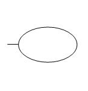
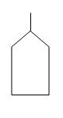
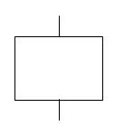
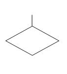

_Draft_

# Fault Tree Analysis (FTA)

## Introduction 
Fault Tree Analysis (FTA) is a deductive top-down failure analysis tool. Starting at the root cause of a potential failure, a breakdown of composite parts is established to identify, analyze and mitigate undesired state of a system. This is usually done visually resembling a flowchart, utilizing branches and specific logical gateways into what is called a _fault tree_. Analysis of the fault tree can be used for:
* Providing clarity and logical foundation directly starting from a failure or otherwise underised state
* Diagnosing and mitigating the caus(es) of a top event.
* A tool in the design phase of a system. 
* 

## History
Fault tree Analysis was originally developed in 1962 Bell laboratories by H. Watson and A Mears, to evaluate the _Minuteman I Intercontinental Ballistic Missile_ for the U.S. Air Force. Since then, fault trees have gained in popularity as a failure analysis tool.

## Underlying systems
Possible underlying system or system predecessor of current hazard analysis

## Variations
Specific variations or successions of main hazard analysis method.

## Application
Used for: (List) \
Most use cases in current day. Type(s) of application domains.

### Event symbols

| Symbol | Meaning |
| :---: | - |
|  | - | 
|  | - |
|  | - |
|  | - |
|  | - |

## Method steps
Specific steps, formulas, symbols and/or terminology

## Example(s)
* Theoretical example
* Example of historical factual application

## Things to avoid
Common (theoretical or practical) mistakes.

## Pros and cons
List of advantages and disadvantages

## Additions/ Notes

## Used terminology
Glossary containing as many relevant and specific terms
| Term | Definition |
| - | - |
| Binary Decision Diagram | - |
| Cut set | Combination of events causing the top event. |
| Common cause | - |
| Logic gate | - |
| Minimal Cut Sets (MCS) | In a cut set, if no event can be removed without failing to cause the top event. |
| Root | Top event |

## See also
### FTA Standards

## References

