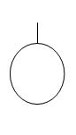

_Draft_

# Fault Tree Analysis (FTA)
This is an early document which serves as a blueprint for adding specific Hazard Analysis Methodologies.

## Introduction 
Abbreviation and full name. 

## History
First inception and cause of hazard analysis method. (Year, person/ group, (geographic) location)
Fault tree Analysis was originally developed in 1962 Bell laboratories by H. Watson and A Mears, to evaluate the _Minuteman I Intercontinental Ballistic Missile_ for the U.S. Air Force. Since then, faul trees have gained in popularity as a failure analysis tool.

## Underlying systems
Possible underlying system or system predecessor of current hazard analysis

## Variations
Specific variations or successions of main hazard analysis method.

## Application
Used for: (List)\
Most use cases in current day. Type(s) of application domains.

## Method steps
Specific steps, formulas, symbols and/or terminology

## Example(s)
* Theoretical example
* Example of historical factual application

## Things to avoid
Common (theoretical or practical) mistakes.

## Pros and cons
List of advantages and disadvantages

## Additions/ Notes
### Event symbols

## Used terminology
Glossary containing as many relevant and specific terms
| Term | Definition |
| - | - |
| Binary Decision Diagram | - |
| Cut set | Combination of events causing the top event. |
| Common cause | - |
| Logic gate | - |
| Minimal Cut Sets (MCS) | In a cut set, if no event can be removed without failing to cause the top event. |
| Root | Top event |

## See also

## References

